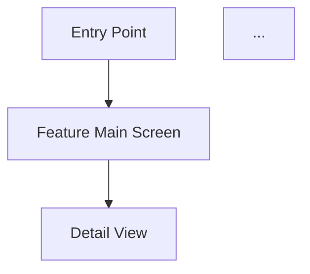

# UI/UX Research

> **Domain plugin (astrology research).** If your environment provides a general `ux-research` / design `user-research` skill, use it for the generic method; this skill adds the astrology-app specifics (domain competitors, domain UX, monetization angles).

Research and recommend the best UI/UX approach for the requested feature,
specifically for a mobile-first astrology app built with Vue 3 + Quasar + Capacitor.

## Process

### 1. Research Best Implementations

Use WebSearch to find:
- `"[feature]" mobile app UX best practices`
- `"[feature]" UI design patterns 2025`
- `"[feature]" astrology app design`
- Dribbble, Behance, Mobbin searches for the feature
- Search for UX case studies: `"[feature]" UX case study`

### 2. Analyze UI Patterns

For each quality implementation found, document:

- **App/Source** — where this pattern is from
- **Screen Layout** — describe the layout structure (cards, lists, tabs, etc.)
- **Color Scheme** — dominant colors, how they convey meaning
- **Typography** — heading/body hierarchy, font choices
- **Interactions** — animations, gestures, transitions
- **Information Architecture** — how content is organized and prioritized
- **Entry Points** — how users discover/access the feature
- **Onboarding** — how the feature is introduced to new users
- **Empty States** — what's shown before data is available
- **Error States** — how errors/loading are handled

### 3. Evaluate for My Zodiac AI

Consider the existing design system:
- Read the glassmorphism/Liquid Glass skill if available (vue-quasar-glass)
- Quasar component library constraints
- Capacitor mobile platform requirements (iOS safe areas, Android back button)
- Dark/light theme support
- Existing navigation patterns in the app

### 4. Recommend Approach

Produce:

**Recommended UI Architecture:**
- Screen hierarchy (new page vs tab vs bottom sheet vs modal)
- Component breakdown (which Quasar components to use)
- Navigation flow (how user gets to and from the feature)

**User Flow Diagram:**
Create a Mermaid diagram showing the complete user journey:

**Key Design Decisions:**
- Layout approach with rationale
- Animation/transition recommendations
- Accessibility considerations
- Performance considerations (heavy visuals vs fast loading)

**Mobile-Specific Considerations:**
- Touch targets (minimum 44px)
- Swipe gestures
- Pull-to-refresh relevance
- Offline behavior
- Platform-specific adaptations (iOS vs Android)

## Rules

- Focus on MOBILE UX — this is a Capacitor app, mobile-first
- Reference real apps and implementations, not abstract theory
- Consider the astrology/spiritual aesthetic — cosmic, elegant, mystical
- Respect existing My Zodiac AI design language (glassmorphism, dark themes)
- Include accessibility notes (contrast ratios, screen reader support)
